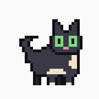
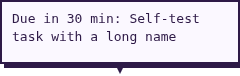
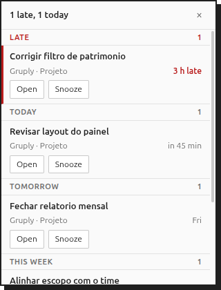
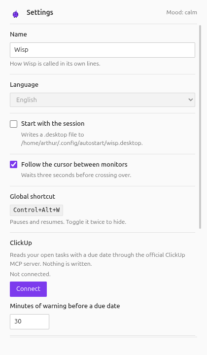

<p align="center">
  
</p>

<h1 align="center">Wisp</h1>

<p align="center">
  A small creature that lives on your desktop, keeps an eye on your tasks and your calendar,
  and tells you when something is about to be due.
</p>

<p align="center">
  
</p>

It walks around, sits down, falls asleep when you stop working, and you can pick it up with the
mouse and drop it somewhere else. When a task is close to its deadline it stops, looks at you
and says so. Click it and you get the list of what is due today, with a button to finish an
item or to put it off for an hour.

Version 0.1.0. It runs on Linux with GNOME, which means Ubuntu and Debian. Windows and macOS
are not supported yet.

---

## What it looks like

|                                                                                         |                                                                                                                                                               |
| --------------------------------------------------------------------------------------- | ------------------------------------------------------------------------------------------------------------------------------------------------------------- |
|    | It speaks in a small bubble above itself. One line, no sound, and it goes away on its own.                                                                    |
|  | Click it and this panel opens with what is due today. Open takes you to the task, Snooze quiets it for an hour, Done finishes it after asking you to confirm. |
|               | Everything is in one settings window. No configuration files to edit.                                                                                         |

## Pick your creature

<p align="center">
  
</p>

Five to choose from, and switching takes effect right away. They behave identically, so the
choice is only about what you want on your screen: the wisp of light it is named after, a cup
of coffee, a black cat, a ghost, or a seedling in a pot.

## Install

Download the file for your system from the [releases page](https://github.com/arthvr9/wisp/releases).

**On Ubuntu, Debian or anything similar, take the `.deb`.** Double click it, or in a terminal:

```
sudo apt install ./Wisp-0.1.0.deb
```

It lands in your applications menu like any other program. This is the option to pick if you
are not sure.

**The `.AppImage` runs without installing anything**, which is useful on other distributions.
Give it permission once and start it:

```
chmod +x Wisp-0.1.0.AppImage
./Wisp-0.1.0.AppImage
```

One catch worth knowing before you download it: an AppImage needs a system library called
libfuse2, which Ubuntu 24.04 and newer no longer ship. If it refuses to start with an error
about `libfuse.so.2`, either install that library, or run it without mounting:

```
./Wisp-0.1.0.AppImage --appimage-extract-and-run
```

Your system may warn that the app comes from an unidentified developer. That is expected. A
signature costs money every year and this project does not have one. Everything you are running
is in this repository.

## First run

The creature appears at the bottom of your screen and starts walking. It does nothing else
until you connect something to it.

**Right click on it** for the menu: Pause, Hide, Poke, Snooze for an hour, Settings, Quit. That
menu always works, so you are never stuck with a mascot you cannot get rid of.

**Open Settings** and give it a name, pick your creature, and connect one of these:

- **ClickUp**, for tasks. Press Connect, your browser opens, you approve, done. There is no
  key to copy and nothing to create beforehand.
- **A calendar**, for meetings. Publish your calendar in Outlook on the web or in Google
  Calendar, copy the link it gives you, paste it in the box. Keep that link private: anyone who
  has it can read your calendar.
- **Gruply Teams**, if your company uses it. Needs your email and an API key from your
  administrator.

Wisp only reads. The one thing it can write is marking a ClickUp task as done, and only after
you confirm it in the panel.

## When it talks to you

It is meant to be ignorable. The rules are deliberately conservative.

| It speaks up when                        | How urgent                                                              |
| ---------------------------------------- | ----------------------------------------------------------------------- |
| A task is due in the next thirty minutes | Normal                                                                  |
| A task is due right now                  | Urgent                                                                  |
| A task is late                           | Normal, then again after an hour, four hours, and once a day after that |
| A task is due later today                | Quiet, once a day                                                       |
| A meeting starts in five minutes         | Normal                                                                  |

At most three interruptions an hour and twelve a day, no matter how much is piling up. You can
change both numbers in settings.

## How to make it shut up

Four ways, from gentlest to most final.

- **Snooze**, in the right click menu, quiets everything for an hour.
- **Quiet hours**, in settings, silence it between two times you choose. Nineteen to eight by
  default. A task due right this minute still gets through.
- **Do Not Disturb**, the switch your own system already has, silences it completely. Wisp
  checks it every thirty seconds.
- **During a meeting** it stays quiet on its own, if you connected a calendar and accepted the
  invitation.
- **Pause or Hide**, in the menu, stops it entirely. Hide also greys out its tray icon, so you
  can tell at a glance that it is off on purpose.

## It has moods

<p align="center">
  
</p>

Finishing things cheers it up. Tasks going late, and being interrupted a lot, wear it down. Six
steps, from dejected to elated, and it moves one step at a time so it never swings wildly.

The mood is not decoration. A worn down creature interrupts you less: at the bottom of the
scale it drops to one interruption an hour. The idea is that a bad day should be quieter, not
noisier. It also moves slower, rests longer, and its face changes, and the tray icon follows
along.

When you finish something it celebrates, and it scales with how much you finished: a hop for
one task, a little dance for two or three, a trophy for four or more.

## An optional voice

Off by default, in which case it uses fixed lines. If you turn it on, a language model rewrites
each line in the creature's own words. Three ways to do that, in settings:

| Option                       | What it means                                                           |
| ---------------------------- | ----------------------------------------------------------------------- |
| Ollama on this machine       | Nothing leaves your computer. Offered first when Wisp finds it running. |
| Any OpenAI-compatible server | Your own endpoint, or a provider like NVIDIA.                           |
| Anthropic                    | Needs an API key.                                                       |

The two cloud options receive the task titles and the current mood. Settings says so next to
the option, in those words. If a model is slow or unreachable, the bubble shows the fixed line
instead and never waits more than two seconds.

## What leaves your computer

Worth being precise about, since this thing reads your work.

| Thing                      | Where it goes                                                               |
| -------------------------- | --------------------------------------------------------------------------- |
| Your tasks and meetings    | Stay on your machine, in a database next to the config file                 |
| Access tokens and API keys | Stored with your system keyring, never in a plain file                      |
| Task titles                | Leave only if you turn on a cloud voice provider, and only to that provider |
| Anything else              | Nowhere. There is no telemetry, no analytics and no account                 |

---

## For developers

Everything below is about the code. Requires Node 22 or newer.

```
npm install
npm run dev            # run from source with hot reload
npm run test           # 338 tests
npm run typecheck
npm run lint
npm run package        # build an installable package for this platform
npm run sprites        # regenerate the sprite art and the README images
npm run harness        # ten minute measurement run, prints a summary
```

### Why the window works the way it does

Under Wayland a client cannot position its own window or keep it above the others. Electron
therefore runs with the X11 Ozone backend and lives inside XWayland, where both still work. The
window is the character: a 96 by 96 pixel frameless, transparent, non-focusable window that
walks across the screen with `setBounds`. There is no fullscreen click-through overlay, because
`setIgnoreMouseEvents` with `forward` does not exist on Linux.

`focusable: false` makes Chromium create an override-redirect X window. Mutter does not manage
it, so it stays above every managed window and never takes keyboard focus. That is exactly what
a mascot needs, and it is also the assumption that makes the port to other platforms
interesting. `TODO.md` has the full study.

Two flags are required when running from source, and both are Linux specific:
`--ozone-platform=x11`, because Electron picks the platform before the main script runs, and
`--no-sandbox`, because Ubuntu 24.04 and newer block unprivileged user namespaces and the
setuid helper inside `node_modules` is not root owned. A packaged build handles both itself.

### How it decides

Every decision is a pure function under `src/main/brain/`, tested with time and randomness
injected, so a whole day can be simulated:

- `movement.ts` eases to a constant walking speed, bounces on an edge with no neighbour, and
  crosses to a touching display, mapping Y proportionally.
- `follow.ts` holds a three second hysteresis before walking toward the monitor with the
  pointer. Under XWayland the pointer position only updates while it is over an X11 window, so
  a stale reading is treated as unknown rather than chased.
- `actor.ts` is a reducer over idle, walk, sit, sleep, alert, drag and celebrate.
- `nudge.ts` holds the rules table, `silence.ts` the silence windows, `mood.ts` the six step
  ladder, `day.ts` what belongs in the panel.

### Connectors

A connector is one file implementing five methods, plus a config entry and a settings section.
The hub knows no source by name. The three that exist share nothing but that interface, which
is the point:

| Source       | How it talks                                                             |
| ------------ | ------------------------------------------------------------------------ |
| ClickUp      | The official MCP server, OAuth with PKCE and dynamic client registration |
| Calendar     | A published ICS link over plain HTTP, parsed and expanded locally        |
| Gruply Teams | A REST API with a bearer token                                           |

Adding Gruply cost one adapter directory, one connector file, and four registrations: the
source union, the config shape, an export, and the line that builds it. The hub did not change.

### What the harness measures

`npm run harness` runs for ten minutes without interaction and writes CSVs plus a summary to
`harness-results/<timestamp>/`: the deviation of every loop tick from its 33 ms target, CPU and
memory per Electron process, and the CPU of `gnome-shell` and `Xwayland` from `/proc`, since the
compositor does the actual moving. On this machine it measures 0.14 percent mean CPU and a p95
loop deviation of 0.31 ms.

### Tested environments

| Machine | OS           | GNOME | Electron | CPU mean | Loop dev p95 | Notes               |
| ------- | ------------ | ----- | -------- | -------- | ------------ | ------------------- |
|         | Ubuntu 26.04 | 50    | 44       | 0.14 %   | 0.31 ms      | Development machine |
|         | Debian 13    |       |          |          |              |                     |

### Layout

```
src/main/index.ts            entry, loop, IPC
src/main/brain/              pure decisions, tested
src/main/stage/              the only place that calls setBounds, setShape, setAlwaysOnTop
src/main/connectors/         the Connector interface, the three connectors, the hub
src/main/ics/                ICS fetch, parser, recurrence expansion
src/main/gruply/             Gruply client and task adapter
src/main/mcp/                MCP client host, OAuth PKCE provider, encrypted secrets
src/main/speech/             prompt, sanitizer, provider adapters
src/main/harness/            environment report, metrics, CSV
src/renderer/                React: mascot canvas, bubble, panel, settings
src/shared/                  poses, config shape, IPC channels, i18n
resources/                   sprite sheets and icons, one folder per mascot
scripts/                     sprite generator, README image and GIF generators
```

### The art

Every mascot is generated by code under `scripts/lib/mascots/`, one module each, and the sheets
follow the Aseprite JSON export so real art can replace them by dropping in two files with the
same tag names. `npm run sprites` regenerates everything, and CI fails if the committed art does
not match its generator.

### Roadmap

| Phase | What                                                      | State     |
| ----- | --------------------------------------------------------- | --------- |
| 0     | Prove the window mechanics and measure the cost           | Done      |
| 1     | The creature walks, sleeps, follows, and can be dismissed | Done      |
| 2     | The first real data, ClickUp over MCP                     | Done      |
| 3     | Rules, silence windows, a budget                          | Done      |
| 4     | Mood, celebration, an optional voice                      | Done      |
| 5     | A second connector, to test the abstraction               | Done      |
| 6     | Click the mascot and act on the day                       | Done      |
| 7     | Package, document, publish                                | Done      |
| 8     | A native GNOME extension instead of the XWayland window   | Not doing |

## The Wayland problem

The hardest part of this project was not the tasks or the mood, it was getting a window to sit
above other windows on a modern Linux desktop at all. `docs/wayland.md` is a field report on
that: what does not work and why, what does work and what it costs, and the accident that
turned out to be the whole design.

Phase 8 in the table above, replacing the XWayland window with a native GNOME extension, is not
being done. The criterion for it was that the current approach had to hurt, and measured over
ten minutes it costs 0.14 percent of one core with a p95 loop deviation of 0.31 ms. The known
price is that following the pointer across monitors barely works, which is documented rather
than fixed.

## License

MIT.
